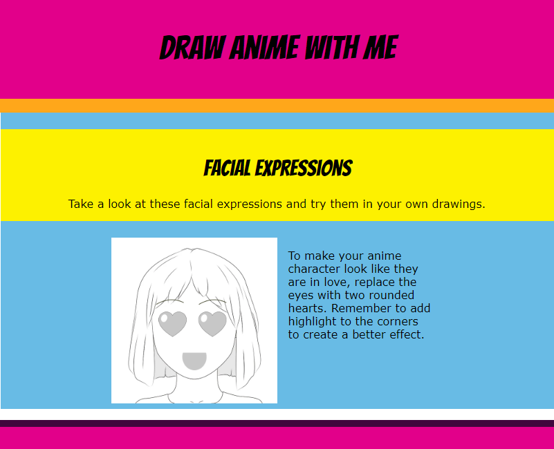

## What you will make

Create and style an anime drawing tutorial webpage with headings, images, colours, fonts, and a responsive layout.

Read through the finished page to explore the tutorial content and see how the layout, styling, and images work together on different screen sizes.

