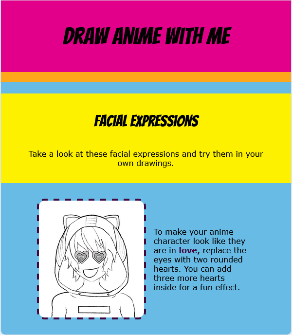

<h2 class="c-project-heading--task">Make it responsive</h2>

### Step 1

CSS can be used to make your web page appear different when viewed on different devices.

--- code ---
---
language: html
filename: index.html
line_numbers: true
line_number_start: 39
line_highlights: 40
---
    <!-- The first drawing and instructions go here -->
    <section class="wrap">
      
      
To make your anime character look like they are in <strong>love</strong>, replace the eyes with two rounded hearts. You can add three more hearts inside for a fun effect.

    </section>

--- /code ---

**Test:** Click the **Run** button. Adjust the size of the output window to see responsiveness of your page.

### Tip

Try out different styles for your web page. Look at the other CSS files, and choose the one that you like the best.

**Test:** Click the **Run** button. 

