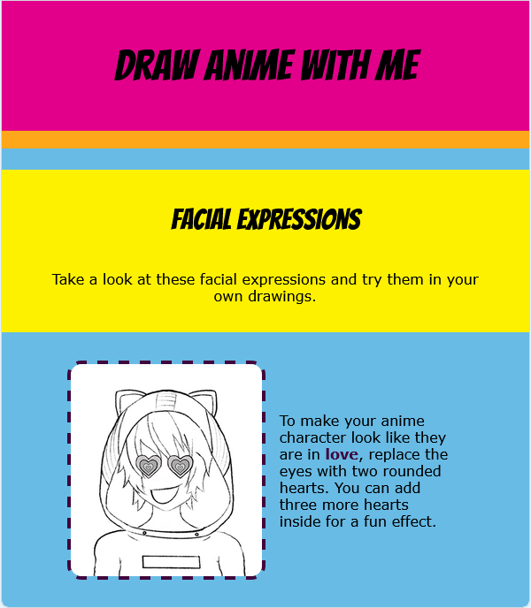

<h2 class="c-project-heading--task">Colours and fonts</h2>

--- task ---

The starter project has different CSS files that you can use.

Go to `index.html` and change the CSS link code to link to the `vivid.css` file: 

--- /task ---

--- code ---
---
language: html
filename: index.html
line_numbers: true
line_number_start: 21
line_highlights: 24
---   
    <!-- Include CSS style file -->

    <link href="style.css" rel="stylesheet" type="text/css" />
    <link href="vivid.css" rel="stylesheet" type="text/css" />

--- /code ---

### Tip

Try out different styles for your web page. Look at the other CSS files, and choose the one that you like the best.

**Test:** Click the **Run** button. 

