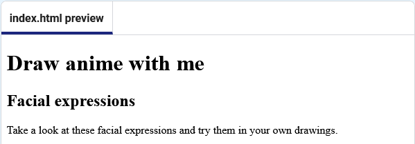

<h2 class="c-project-heading--task">Add a paragraph</h2>

Underneath your `<h2>` heading code, add the paragraph `
` tags.

Between the `
` tags, add in some introductory text.

Your code should look like this:

 
 

--- code ---
---
language: html
filename: index.html
line_numbers: true
line_number_start: 33
line_highlights: 37
---
    <!-- The main content for the web page goes between the main tags -->
    <main>
      <section>
        <h2>Facial expressions</h2>
        
Take a look at these facial expressions and try them in your own drawings.

      </section>
        <!-- The first drawing and instructions go here --> 

--- /code ---

### Tip

Use `
` tags for blocks of text such as introductions, descriptions, or instructions.

## Now run your code

Your page should look like this:

Click the **Run** button and check that the page now shows the heading and the introduction paragraph.
