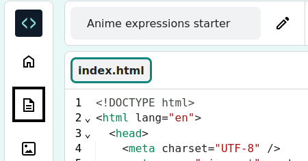
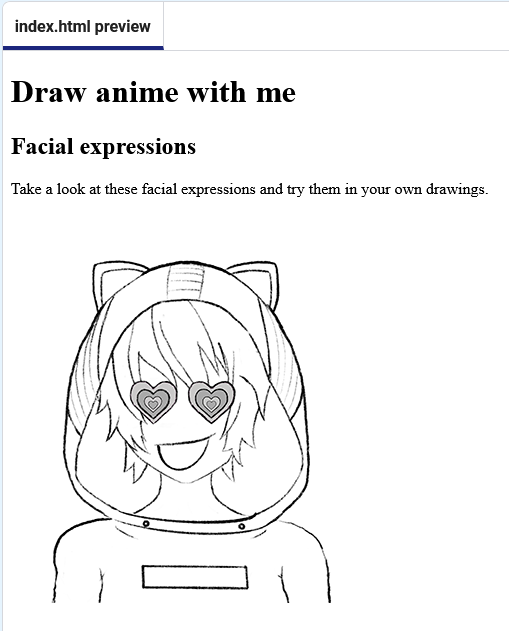

## Add a facial expression



> [!INFO]
>
> Your starter project contains images to use in this project. `love.png` is one of the images.

Add a new `<section>` tag for your first facial expression.

The `` tag does not have an end tag.

```html filename="index.html" line_numbers="true" line_number_start="39" line_highlights="40-42"
      <!-- The first drawing and instructions go here -->     
      <section>
        
      </section> 

```

> [!TIP]
>
> **Alternative (alt) text** is a description of an image and is important in accessible web design as it describes images to people who are unable to see them. The text does not appear on the webpage, but it is read aloud by screen readers.

## Now run your code

Your page should now have an image.



Click the **Run** button and check that an anime expression image appears on the page.
