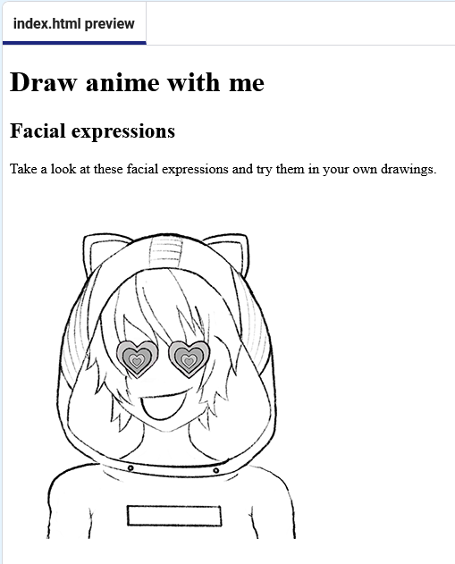

<h2 class="c-project-heading--task">Add a facial expression</h2>

--- task ---

Brilliant stuff! You've added some content to your web page.

Your starter project contains images to use in this project. `love.png` is one of the images.

Add a new `<section>` tag and inside your new section, add an `` tag to display an image on your webpage. The `src` **attribute** gives the name of the image.

The `` tag doesn't have an end tag.

--- /task ---
 
 

--- code ---
---
language: html
filename: index.html
line_numbers: true
line_number_start: 40
line_highlights: 41-43
---   
      <!-- The first drawing and instructions go here -->     
      <section>
        
      </section> 

--- /code ---

### Tip

**Alternative (Alt) text** is a description of an image and is important in accessible web design to describe images to people who are unable to see them. The text does not appear on the web page but it is read aloud by screen readers.

**Test:** Click the **Run** button. 

Your page should now have an image.

