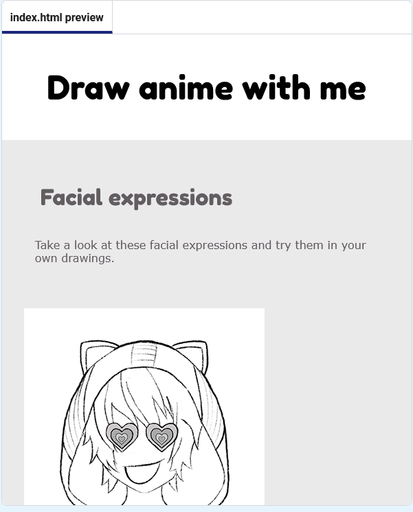

<h2 class="c-project-heading--task">Style your page</h2>

The next steps show you how to use CSS to change the colours, fonts, and layout on your web page.

--- code ---
---
language: html
filename: index.html
line_numbers: true
line_number_start: 21
line_highlights: 23-24
---   
    <!-- Include CSS style file -->

    <link href="style.css" rel="stylesheet" type="text/css" />
    <link href="candy.css" rel="stylesheet" type="text/css" />
  </head>

--- /code ---

### Tip

To collapse the `<head>` section after you have seen the change, click the arrow next to it. 

CSS is a style sheet language that defines the presentation of HTML documents, including layout, colours, fonts, and spacing.

## Now run your code

Now your page should look like this:

Click the **Run** button and check that the page now uses the new background colours and fonts.
