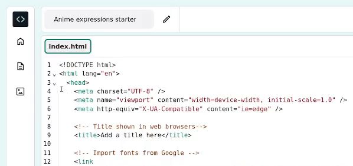

<h2 class="c-project-heading--task">Style your page</h2>

--- task ---

Amazing work so far! The next steps show you how to use CSS to change the colours, fonts, and layout on your web page.

Unfold the `<head>`{:.language-html} section of your code so that you can view the code inside it.

At the bottom of your `<head></head>`{:.language-html} section, remove the `<!--`{:.language-html} and `-->`{:.language-html} arrows from the start and end of both lines of link code:

--- code ---
---
language: html
filename: index.html
line_numbers: true
line_number_start: 21
line_highlights: 23-24
---   
    <!-- Include CSS style file -->

    <link href="style.css" rel="stylesheet" type="text/css" />
    <link href="candy.css" rel="stylesheet" type="text/css" />
  </head>

--- /code ---

--- /task ---

### Tip

To collapse the `<head>`{:.language-html} section after you have seen the change, click the arrow next to it. 

CSS is a style sheet language that defines the presentation of HTML documents, including layout, colors, fonts, and spacing.

**Test:** Click the **Run** button. 