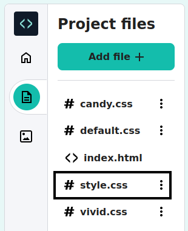

<h2 class="c-project-heading--task">Edit your style sheet</h2>

--- task ---
Click on the `Project files` icon in the Code Editor.

--- /task ---

--- task ---
Select the `style.css` file to open it in a new tab.
--- /task ---

--- task ---
**Find:** Scroll down and find the rule that controls the style of the `<h2>`. 
--- /task ---

At the moment, the `<h2>` heading is aligned to the left.

--- task ---
Change the `text-align` property of the `h2` rule to `center`.
--- /task ---

--- code ---
---
language: css
filename: style.css
line_numbers: true
line_number_start: 109
line_highlights: 111
---  

h2 {
  font: var(--title-font); /* Font style stored in the title-font variable */
  text-align: center; /* Align the text */
  padding: 1.5rem; /* Add some space all around the heading */
}

--- /code ---

### Tip

When you add CSS styling to an **element**, it applies that styling to every single element on the page that has the same tag. 

**Test:** Click the **Run** button. 
